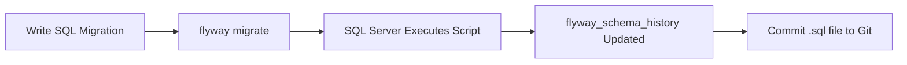
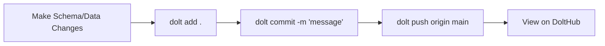

# Database Version Control: R&D Presentation Guide
## Flyway vs Dolt — Two Approaches to Managing Database Changes

---

## 1. The Problem

> How do you track, review, and collaborate on database schema changes the same way you do with application code?

Without database version control:
- Schema changes are ad-hoc SQL scripts run manually
- No audit trail of *who* changed *what* and *when*
- Rolling back a bad migration is dangerous guesswork
- No branching — you can't test a schema change in isolation
- Team members overwrite each other's changes

---

## 2. The Two Tools

### 🛩️ Flyway — Migration-Based Version Control

| Aspect | Detail |
|--------|--------|
| **What it is** | A migration runner — executes numbered SQL scripts in order |
| **Analogy** | Like a changelog or ledger — sequential entries that build up your schema |
| **Language** | Native SQL (T-SQL, MySQL, PostgreSQL — whatever your DB speaks) |
| **Storage** | Tracks migration history in a `flyway_schema_history` table inside your DB |
| **Hub** | None — migrations live in your Git repo alongside your code |

### 🐬 Dolt — Git for Databases

| Aspect | Detail |
|--------|--------|
| **What it is** | A full database engine with built-in Git semantics (branch, commit, merge, diff) |
| **Analogy** | Like Git, but every commit is a complete snapshot of your database (schema + data) |
| **Language** | MySQL-compatible SQL dialect |
| **Storage** | Self-contained database with full commit history |
| **Hub** | [DoltHub](https://www.dolthub.com) — like GitHub but for databases, with web UI for branches, diffs, and PRs |

---

## 3. How They Work

### Flyway Workflow



**Key concept**: You write **forward-only** SQL scripts. Flyway runs them in version order.

```
Database/Migrations/
├── V1__baseline.sql          ← Initial schema snapshot
├── V2__add_notifications.sql ← New table
├── V3__add_labels_column.sql ← Alter existing table
```

### Dolt Workflow



**Key concept**: Every commit is a **full snapshot**. You can branch, diff, merge, and even open Pull Requests on your database.

---

## 4. Live Demo Guide

### Demo 1: Flyway — Run a New Migration

```powershell
# Step 1: Create a new migration file
cd c:\dev\notjira\worknest\Database

# Step 2: Create V2 migration
@"
CREATE TABLE [dbo].[Labels] (
    [Id]          UNIQUEIDENTIFIER NOT NULL PRIMARY KEY DEFAULT NEWID(),
    [Name]        NVARCHAR(100) NOT NULL,
    [Color]       NVARCHAR(7) NOT NULL DEFAULT '#3B82F6',
    [SpaceId]     UNIQUEIDENTIFIER NOT NULL,
    CONSTRAINT [FK_Labels_Spaces] FOREIGN KEY ([SpaceId]) REFERENCES [dbo].[Spaces]([Id])
);
GO
"@ | Out-File -FilePath "Migrations\V2__add_labels_table.sql" -Encoding UTF8

# Step 3: Check status (shows V2 as Pending)
..\flyway_cli\flyway.cmd -configFiles=flyway.conf info

# Step 4: Run the migration
..\flyway_cli\flyway.cmd -configFiles=flyway.conf migrate

# Step 5: Verify (shows V2 as Success)
..\flyway_cli\flyway.cmd -configFiles=flyway.conf info
```

**What the audience sees**: V2 moves from `Pending` → `Success`. The `Labels` table now exists in SQL Server.

### Demo 2: Dolt — Branch, Change, Diff, Merge

```powershell
cd c:\dev\notjira\worknest\DoltDB

# Step 1: Create a feature branch (just like git!)
dolt checkout -b feature/add-labels

# Step 2: Add a new table
dolt sql -q "CREATE TABLE Labels (
    Id CHAR(36) NOT NULL PRIMARY KEY,
    Name VARCHAR(100) NOT NULL,
    Color VARCHAR(7) NOT NULL DEFAULT '#3B82F6',
    SpaceId CHAR(36) NOT NULL
);"

# Step 3: See the diff (shows exactly what changed)
dolt diff

# Step 4: Commit the change
dolt add .
dolt commit -m "Add Labels table"

# Step 5: Switch back to main and merge
dolt checkout main
dolt merge feature/add-labels

# Step 6: View the log (shows full history with hashes)
dolt log

# Step 7: Push to DoltHub
dolt push origin main
```

**What the audience sees**: Full Git workflow — branching, diffing, merging — but for the database. Then view it on [dolthub.com/repositories/borabu/worknest-db](https://www.dolthub.com/repositories/borabu/worknest-db).

---

## 5. Comparison: Flyway vs Dolt

| Feature | Flyway | Dolt |
|---------|--------|------|
| **Approach** | Migration scripts (versioned `.sql` files) | Full database versioning (Git semantics) |
| **Schema tracking** | ✅ Ordered SQL scripts | ✅ Commit snapshots |
| **Data tracking** | ❌ Schema only | ✅ Schema AND data |
| **Branching** | ❌ Not supported | ✅ Full branch/merge/diff |
| **Diffing** | ❌ Compare files manually | ✅ `dolt diff` shows schema + row changes |
| **Pull Requests** | ❌ (use Git PRs for .sql files) | ✅ Native DB pull requests on DoltHub |
| **Rollback** | ⚠️ Write a new migration (OSS). Undo in paid. | ✅ `dolt checkout` / `dolt reset` |
| **Production DB support** | ✅ SQL Server, PostgreSQL, MySQL, Oracle, etc. | ⚠️ Dolt is its own MySQL-compatible engine |
| **Integration with existing DB** | ✅ Runs against your live database | ⚠️ Separate database (replaces or mirrors) |
| **CI/CD friendly** | ✅ Widely used in pipelines | ✅ DoltHub API + CLI |
| **Learning curve** | Low — just write SQL files | Medium — need to learn Git-for-DB concepts |
| **Cost** | Free (OSS) / Paid (Teams) | Free (OSS + DoltHub) / Paid (Hosted) |
| **Best for** | Production schema migrations | R&D, data versioning, collaboration |

---

## 6. When to Use What

### Use **Flyway** when:
- ✅ You need to manage schema changes on an **existing production database** (SQL Server, PostgreSQL, etc.)
- ✅ Your team already uses Git for code — Flyway `.sql` files live right in the repo
- ✅ You want a simple, proven approach with CI/CD integration
- ✅ You don't need to version data, just schema

### Use **Dolt** when:
- ✅ You need to version **both schema and data** (e.g., ML datasets, reference tables)
- ✅ You want true database branching — test schema changes in isolation
- ✅ You need to **diff** database states (what changed between releases?)
- ✅ You want a GitHub-like collaboration experience for databases (PRs, reviews)
- ✅ You're starting a new project and can use Dolt as your primary DB engine

### Use **both together** when:
- ✅ Flyway manages your production SQL Server migrations
- ✅ Dolt serves as a parallel "time machine" for R&D, testing, and data snapshots

---

## 7. Our Setup

### Flyway

| Item | Location |
|------|----------|
| CLI | `worknest/flyway_cli/` (gitignored) |
| Config | `worknest/Database/flyway.conf` |
| Migrations | `worknest/Database/Migrations/V*.sql` |
| Target DB | SQL Server `WorknestDB` on `localhost:1433` |
| GitHub Branch | `feature/flyway-database-versioning` |

### Dolt

| Item | Location |
|------|----------|
| CLI | `dolt.exe` in PATH |
| Local DB | `worknest/DoltDB/` (gitignored) |
| Remote | [dolthub.com/repositories/borabu/worknest-db](https://www.dolthub.com/repositories/borabu/worknest-db) |
| Tables | 16 tables mirroring WorknestDB schema |

---

## 8. Key Commands Cheat Sheet

### Flyway
```powershell
cd c:\dev\notjira\worknest\Database
..\flyway_cli\flyway.cmd -configFiles=flyway.conf info      # Show status
..\flyway_cli\flyway.cmd -configFiles=flyway.conf migrate   # Apply pending
..\flyway_cli\flyway.cmd -configFiles=flyway.conf validate  # Check consistency
..\flyway_cli\flyway.cmd -configFiles=flyway.conf repair    # Fix history table
```

### Dolt
```powershell
cd c:\dev\notjira\worknest\DoltDB
dolt status                        # Show uncommitted changes
dolt diff                          # See what changed
dolt log                           # View commit history
dolt add .                         # Stage all changes
dolt commit -m "message"           # Commit
dolt checkout -b branch-name       # Create branch
dolt merge branch-name             # Merge branch
dolt push origin main              # Push to DoltHub
dolt sql -q "SELECT * FROM ..."    # Run SQL queries
```

---

## 9. Conclusion

| | Flyway | Dolt |
|---|---|---|
| **Think of it as** | Database changelog | Git for databases |
| **Strength** | Battle-tested production migrations | Revolutionary data versioning |
| **Limitation** | No branching, no data versioning | Separate DB engine, not SQL Server |
| **Verdict** | **Use for production** | **Use for R&D and collaboration** |

> **Recommendation**: Use Flyway for managing your production SQL Server schema migrations today. Keep an eye on Dolt for future projects where data versioning and database branching would add significant value.
